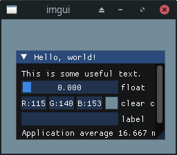

# imgui_imp_rgfw.h 
RGFW platform backend for Dear ImGUI

# example

The example uses RGFW with imgui and opengl2 

To compile the example, run
`cd example`
then build with `make` 

```sh
make debug
```

This compiles RGFW, ImGUI and then main.cpp 